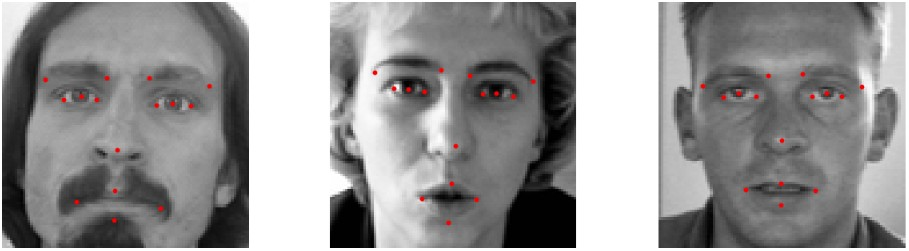

# Facial Keypoints Detection with Deep Learning

This project detects **15 facial keypoints** (eyes, eyebrows, nose, mouth) from grayscale face images using **Convolutional Neural Networks (CNNs)**.

It is based on the [Kaggle Facial Keypoints Detection](https://www.kaggle.com/competitions/facial-keypoints-detection/data) dataset and includes:

- 📊 Data preprocessing and augmentation
- 🧠 CNN model design and training
- 🧪 Keypoint prediction and visualization
- 💻 Gradio web app for real-time inference


## 📸 Example Outputs

| Sample of Face Training Images with Annotated Keypoints   |
| --------------------------------------------------------- |
|  |


## 📂 Dataset Description

We use the [Facial Keypoints Detection Dataset](https://www.kaggle.com/competitions/facial-keypoints-detection/data) from `Kaggle`, which contains images with **15 facial keypoints**.

Each **predicted keypoint** is specified by an (x,y) real-valued pair in the space of pixel indices. There are **15 keypoints**, which represent the following elements of the face:

**left_eye_center, right_eye_center, left_eye_inner_corner, left_eye_outer_corner, right_eye_inner_corner, right_eye_outer_corner, left_eyebrow_inner_end, left_eyebrow_outer_end, right_eyebrow_inner_end, right_eyebrow_outer_end, nose_tip, mouth_left_corner, mouth_right_corner, mouth_center_top_lip, mouth_center_bottom_lip**

Left and right here refers to the point of view of the subject.

In some examples, some of the target keypoint positions are misssing (encoded as missing entries in the csv, i.e., with nothing between two commas).

The input image is given in the last field of the data files, and consists of a list of pixels (ordered by row), as integers in (0,255). The images are 96x96 pixels.

The dataset is contains 3 files:
- `training.csv`: list of **training 7049 images**. Each row contains the (x,y) coordinates for 15 keypoints, and image data as row-ordered list of pixels.
- `test.csv`: list of **1783 test images**. Each row contains ImageId and image data as row-ordered list of pixels
- `submissionFileFormat.csv`: list of **27124 keypoints to predict**. Each row contains a RowId, ImageId, FeatureName, Location. FeatureName are "left_eye_center_x," "right_eyebrow_outer_end_y," etc. Location is what you need to predict. 


## 🛠️ Requirements

Install required libraries:
```bash
pip install tensorflow pandas numpy matplotlib scikit-learn gradio opencv-python
```


## 🧠 Model Used
```bash
model = Sequential([
    Conv2D(32, (3,3), activation='relu', input_shape=(96, 96, 1)),
    MaxPooling2D(2,2),
    BatchNormalization(),
    Dropout(0.1),

    Conv2D(64, (3,3), activation='relu'),
    MaxPooling2D(2,2),
    BatchNormalization(),
    Dropout(0.2),

    Conv2D(128, (3,3), activation='relu'),
    MaxPooling2D(2,2),
    BatchNormalization(),
    Dropout(0.3),

    Flatten(),
    Dense(512, activation='relu'),
    Dropout(0.5),
    Dense(30)
])
```
- Loss: Mean Squared Error (MSE)
- Metrics: Mean Absolute Error (MAE)
- Optimizer: Adam
- Output: 30 floating-point values representing 15 (x, y) keypoints


## 🏋️ Training

- Input: Normalized images in range [0, 1]
- Output: Normalized keypoints (divided by 96)
- Validation split: 10%
- Epochs: 100+ (early stopping suggested)
- Batch size: 64
```bash
model.fit(X_train, y_train, validation_data=(X_val, y_val), epochs=100, batch_size=64)
```


## 🖼️ Visualization

Visual tools include:
- Display of images with predicted vs. actual keypoints
- Plot of training & validation loss over time


## 📷 Interactive Gradio App

Run the app locally:
This will start a web UI where users can:
- Upload a face image
- See the **15 predicted keypoints** overlaid on the face

```bash
import gradio as gr

iface = gr.Interface(
    fn=predict_keypoints,
    inputs=gr.Image(type="numpy"),
    outputs=gr.Image(type="numpy"),
    title="Facial Keypoints Detection",
    description="Upload a face image. The model predicts 15 facial keypoints."
)
iface.launch()
```


## ✅ Results

- Validation MAE: ~0.019 (pixels)
- Model captures essential facial structure
- Gradio app performs well on real faces

"# Facial_Keypoints_Detection" 
